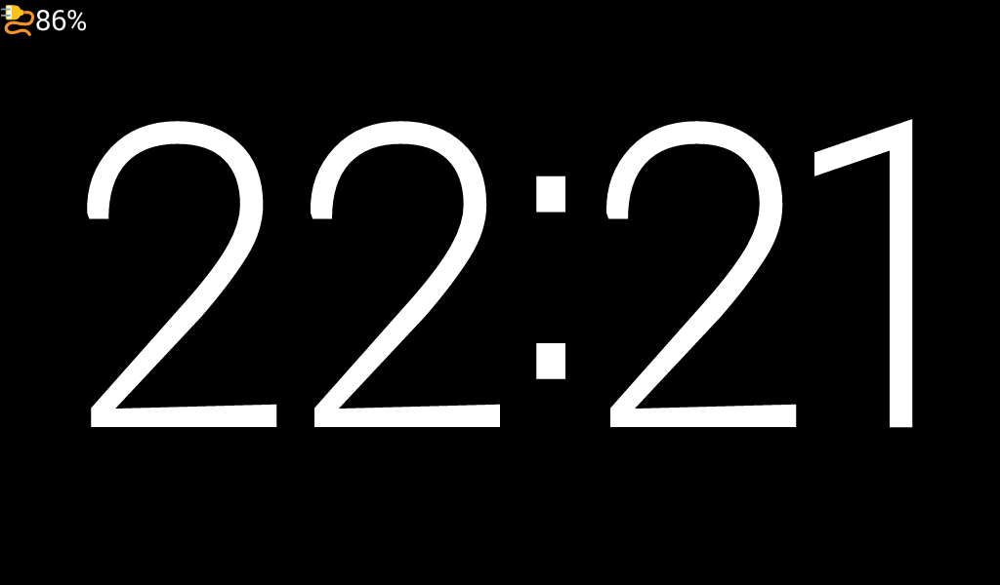
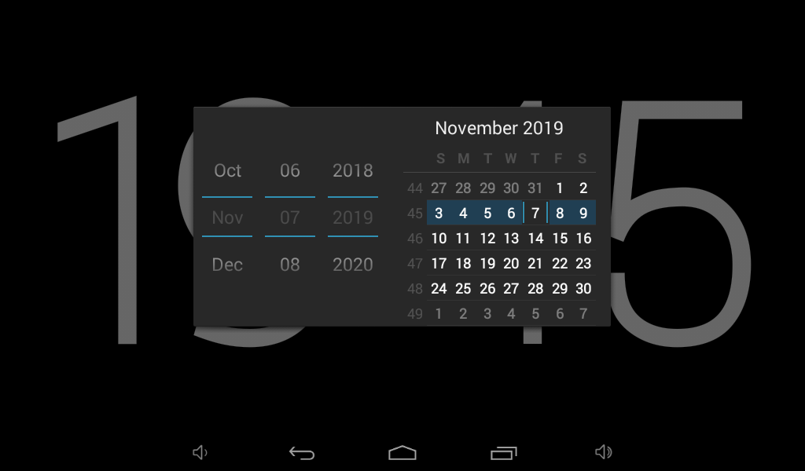
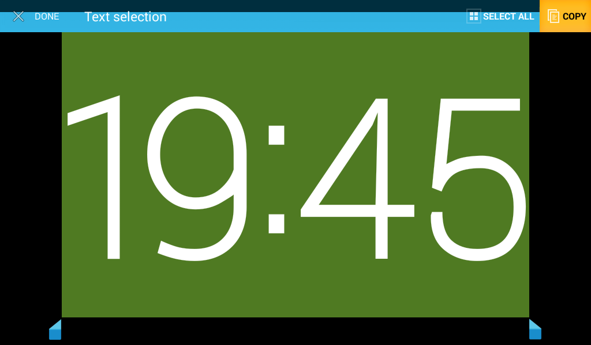

# HMClockScreen

`Let your waste Android tablet become a simple digital clock.`

## HH:mm-style

## Calendar dialog `Click`

## Copy the current time `Long press`

###  Build with [AndResGuard](https://github.com/shwenzhang/AndResGuard)

* Modify `signInfo_example.properties` and rename it to `signInfo.properties`

* Execute gradle task: `resguardRelease`